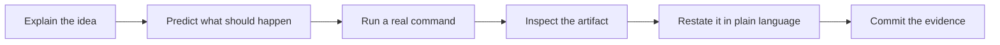

# Project goal

This project has two equal outcomes:

1. Produce a credible, open-source, reprogrammable protocol-emulator ASIC.
2. Make Khangelani capable of understanding, operating, questioning and
   defending the work without depending on unexplained expert judgement.

The technical research question remains:

> What is the smallest computational substrate that can efficiently express
> useful digital communication protocols under hard temporal constraints?

The learning question is equally important:

> Can every design claim be connected to a source file, an executable command,
> an inspectable result, and a clear explanation of what was and was not proved?

## Working contract

Use this loop throughout the project:

- Introduce terminology only when it helps describe something concrete.
- Connect each concept to a repository file, command and visible result.
- Recommend a default before presenting unfamiliar alternatives.
- Distinguish verified facts, hypotheses, decisions, failures and open questions.
- Treat missing evidence as `NOT_EVALUATED`, never as an implied pass.
- Preserve failed experiments when they affect the next decision.
- End each milestone with both a technical gate and a learning gate.
- Keep learning progress conservative: automation can validate the record and
  resources, but only an owner explanation and follow-up reasoning can satisfy
  a fluency criterion.

The aim is not command memorisation. Fluency means being able to reconstruct
the workflow, interrogate its evidence, make a bounded change, and explain why
the resulting claim is justified.
