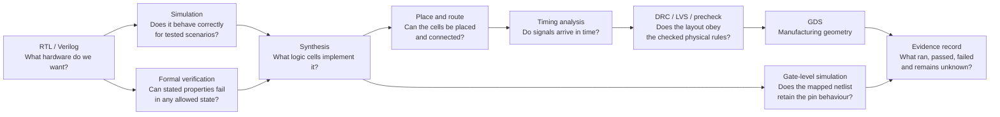

# From Verilog to a chip

This is the project's main learning map. Read it left to right. Each box asks a
different question, so a pass in one box cannot substitute for a later box.

## The current M0 example

The M0 design is intentionally an eight-bit counter, not yet a protocol
machine. It is small enough that we can learn the complete flow without
confusing toolchain failures with architectural complexity.

| Stage | Concrete object | Command or service | Visible result |
|---|---|---|---|
| RTL | `src/project.v` | Read the source | Counter state transition |
| Specification | `docs/specs/m0-gpio.md` | Compare source with table | Expected pin value per edge |
| Simulation | `test/test.py` | `make test` in the tool container | JUnit result and FST waveform |
| Formal | `formal/m0_gpio_formal.sv` | `make formal` | Proof status, wrap witness, and rejected mutant trace |
| Generic synthesis | `src/project.v` | `make synth` | Yosys log and structural JSON |
| Physical flow | `src/config.json` plus RTL | GitHub `gds` workflow | Reports, netlist, GDS and render |
| Gate-level test | Mapped netlist plus the same test | `make GATES=yes` in the official action | JUnit result and waveform |
| Evidence | `evidence/` | Evidence collector and review | Claim, limitations and hashes |
| Guided inspection | Archived M0 source plus E0007/E0010 | `workbench.ps1 LearnM0` | Source anchors, measured results, limits and teach-back prompt |

## What the stages do not prove

- A simulation pass covers the scenarios that were exercised; it is not proof
  of every possible input sequence.
- A formal proof covers the written properties and assumptions; it cannot prove
  a property that nobody specified.
- Generic synthesis confirms structural plausibility; it does not establish
  IHP cell area, routing or timing.
- Zero-delay gate-level simulation checks logical behaviour; it is not a
  post-layout timing simulation.
- Open-source DRC, LVS and precheck are required evidence, but are not a foundry
  signoff guarantee.
