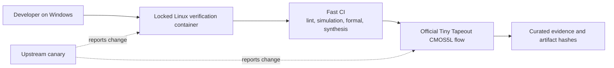

# Open-source ASIC infrastructure

The competition requires an open-source design. For this project, that means
more than making a repository public: another person should be able to inspect
the source, identify the tools, reproduce the checks, see failures and evaluate
the limits of each claim.

## Two deliberately separate lanes

1. The **fast verification lane** gives rapid feedback using open tools in a
   pinned container.
2. The **physical qualification lane** uses the official Tiny Tapeout CMOS5L
   GitHub action. Only this lane can support M0 physical-fit claims.

Do not add OpenLane 1 or direct OpenROAD Flow Scripts as a competing tapeout
path. They may be useful research references, but parallel acceptance flows
would make results harder to compare and explain.

## Tool roles

| Tool or project | Role here | Claim boundary |
|---|---|---|
| Git and GitHub | Source history, CI identity and durable releases | A commit records content; it does not prove correctness |
| Docker | Repeatable Linux execution environment on the Windows host | An image is reproducible only when its inputs and digest are recorded |
| Icarus Verilog | Primary RTL and official gate-level simulator | Zero-delay digital behaviour, not analog or post-layout delay |
| cocotb | Python testbench and independent pin-level oracle | Covers implemented scenarios and seeds |
| Verilator and Verible | Semantic lint and an independent parser/simulator path | Strong diagnostics, not physical implementation |
| Yosys | Generic and technology-mapped synthesis | Generic synthesis alone is not CMOS5L fit |
| SBY plus solvers | Formal property checking | Proves only stated properties under stated assumptions |
| LibreLane | Orchestrates synthesis, place, route and physical checks | Reports must be tied to an exact PDK and configuration |
| OpenROAD/OpenSTA | Placement, routing and timing engines inside LibreLane | Timing is scoped to encoded models and corners |
| IHP Open PDK CMOS5L | Cell libraries and process/tool data | Open checks are not a foundry guarantee |
| Tiny Tapeout actions | Competition integration, precheck and artifacts | This is the project acceptance path for M0 |

## First qualified physical snapshot

The first observed physical run resolved these identities. They are recorded as
evidence before any pinning decision:

| Component | Identity |
|---|---|
| Tiny Tapeout GDS action | `3412659307918422f3f0727917cf9b499aaca588` |
| Tiny Tapeout support tools | `d66cf179e7bc4d296362ab7e2e3b344dc3c4f665` |
| LibreLane | `3.1.0.dev3` |
| PDK source | `IHP-Open-PDK` |
| PDK revision | `2bbec755dc67ca3db0261c3d6163e15735d66710` |

Think of these as ingredient batch numbers. “LibreLane was used” is too vague
to reproduce an experiment; the exact version and PDK revision make the claim
inspectable.

## Authoritative starting sources

- [Jane Street competition brief](https://blog.janestreet.com/protocol-emulator-asic-competition/)
- [Tiny Tapeout IHP Verilog template](https://github.com/TinyTapeout/ttihp-verilog-template/tree/cmos5l)
- [Tiny Tapeout local hardening guide](https://www.tinytapeout.com/guides/local-hardening/)
- [LibreLane documentation](https://librelane.readthedocs.io/en/stable/)
- [IHP Open PDK](https://github.com/IHP-GmbH/IHP-Open-PDK)
- [OSS CAD Suite](https://github.com/YosysHQ/oss-cad-suite-build)

Recheck changeable upstream guidance before qualification and release.

## Public repository controls

The repository became public on 25 September 2026 only after E0004's history,
working-directory, license, object-size and CI audit. GitHub secret scanning,
push protection, Dependabot security updates and private vulnerability
reporting are enabled. These controls reduce publication and contribution risk;
they do not replace review or justify placing credentials in test data.
