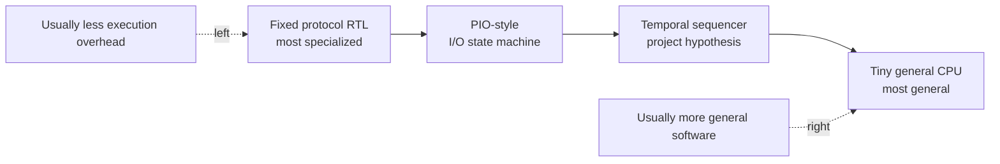

# Protocol-emulator architecture landscape

Status: research record, 25 September 2026. No architecture is selected here.
Exact source identities are in [`source-lock.json`](source-lock.json).

## The question in plain language

A **computational substrate** is the reusable hardware that runs protocol
behaviour. It is the part between a stored program and the physical pins. The
research question asks how little of that hardware we can keep while still
changing protocols after fabrication and meeting exact timing.

“Smallest” cannot mean one convenient number. It must include the execution
core, program and data storage, program-loading path, pin-direction logic,
input synchronization, queues and any protocol-specific escape block needed to
make the demonstration work.



The arrows are a design-space map, not measured rankings. The evaluation
contract will determine what this project can actually claim.

## Four families worth testing

| Family | What it means | Reprogrammable after fabrication? | Likely strength | Cost or risk | Role here |
|---|---|---:|---|---|---|
| Fixed protocol RTL | A dedicated state machine for one UART, SPI or I2C role | No, except configuration already designed into it | Direct timing and low per-protocol overhead | A new protocol needs new silicon | Protocol-specific lower bound and waveform oracle |
| PIO-style I/O engine | A tiny instruction machine specialized for pins, shifts, waits and deterministic timing | Yes | Good match to cycle-exact I/O with a small instruction set | Specialized registers, FIFOs and pin machinery still consume area | Closest established architectural precedent |
| Temporal sequencer | A small project-specific machine where instructions say what pins do and when | Yes, if its program store is writable | Every retained instruction can serve the research question directly | An invented ISA can hide missing semantics or protocol-specific shortcuts | Primary hypothesis, still unproven |
| Tiny general CPU | A conventional programmable core plus memory-mapped or bit-banged I/O | Yes | Existing ISA, tools and broad programmability | Fetch/decode/register overhead and variable event latency may be wasteful | Generality baseline, not the assumed winner |

The fixed blocks are not competition candidates because they fail the
post-fabrication programmability requirement. They remain scientifically useful:
they show the logic cost of a protocol when no reusable interpreter is present.

## What the established sources actually say

### PIO-style precedent

The pinned Raspberry Pi Pico SDK source [S9] describes RP2040 as containing two
PIO blocks, each with four independently programmable state machines. Each state
machine has shift registers, scratch registers, a fractional clock divider and
FIFO access. The companion instruction header exposes nine major operations:
`JMP`, `WAIT`, `IN`, `OUT`, `PUSH`, `PULL`, `MOV`, `IRQ` and `SET`.

That is evidence that a compact, I/O-specialized instruction machine is a
practical architecture. It is not an area result for this project: RP2040 uses
a different process, surrounds PIO with a much larger system and provides more
state machines and storage than this chip may afford.

### Tiny CPU baselines

SERV [S10] is a bit-serial RISC-V core. Its README reports a typical CMOS result
of 2.1 kGE and documents a bit-banged UART whose baud rate changes with the CPU
clock. This makes SERV useful for two lessons: serialized datapaths can reduce
logic, and general instruction timing becomes part of the protocol timing
budget. The 2.1 kGE number is an upstream report, not an IHP CMOS5L measurement.

PicoRV32 [S11] is a configurable RV32E/RV32I/RV32IMC core. Its README reports
about four cycles per instruction under stated memory assumptions and FPGA sizes
in LUTs. It represents a faster, wider general-purpose baseline than SERV. Its
repository was archived when this snapshot was taken, and neither its LUT count
nor its reported clock rate is comparable with final IHP area or timing.

### Fixed, production-oriented protocol IP

OpenTitan [S12] provides separate UART, SPI-host and I2C blocks. Its I2C theory
of operation covers controller and target roles, FIFOs, open-drain signalling,
clock stretching, synchronization, interference and bounded timeout behaviour.
This is a valuable checklist of real protocol obligations.

OpenTitan is not a “smallest block” reference: its bus interfaces, registers,
interrupts, FIFOs, security design and SoC context intentionally solve a larger
problem. We use it to avoid an unrealistically narrow feature definition, not
as an area target.

## Contemporary competition scan

Three public competition repositories were inspected at exact commits [C1-C3].
Their READMEs describe small deterministic CPUs or multiple sequencer engines,
post-fabrication program loading and protocol firmware. This convergence is a
design-space observation only.

No claimed protocol count, verification count, GDS result, area or timing from
those repositories has been reproduced here. Their self-reports are therefore
`NOT_EVALUATED`, not imported evidence. We will not copy an instruction set or
select an architecture by popularity; independent workloads and measurements
must decide.

## What this changes—and what it does not

The research narrows the credible comparison to three programmable families:
PIO-style, temporal-sequencer and tiny-CPU. Fixed RTL remains the per-protocol
lower bound. It also establishes four accounting rules:

1. Count support hardware, not just the execution core.
2. Measure identical protocol workloads and pin behaviour.
3. Keep upstream LUT/kGE reports separate from our IHP measurements.
4. Treat every unrun claim as `NOT_EVALUATED`.

It does **not** start M1, define the project ISA or prove that the temporal VM is
best. Those decisions wait for the M0 fluency gate and the shared evaluation
contract.

## Inspect this record

From the repository root:

```powershell
Get-Content docs\research\architecture-landscape.md
python -m json.tool docs\research\source-lock.json
.\tools\workbench.ps1 Check
```

The first command reads the argument, the second proves the source lock is valid
JSON, and the third checks its required identities and the rest of the project
metadata. None of those commands reproduce an upstream hardware claim.
