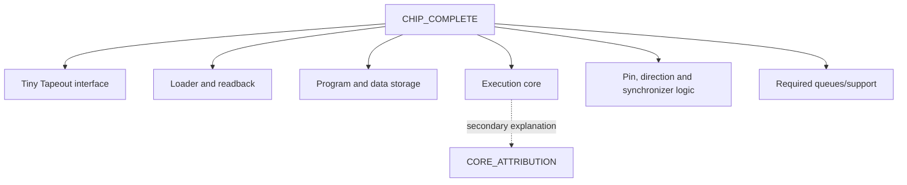

# Architecture evaluation contract

Status: adopted comparison method, 25 September 2026. It defines the ruler; it
does not select an architecture or start M1. The machine-readable vocabulary is
[`evaluation-contract.json`](evaluation-contract.json).

## Why a contract is needed

Architectures can look artificially small when different costs are omitted. A
CPU core without its memory, a sequencer without its loader and a PIO engine
without its FIFOs are not comparable chips. Likewise, an FPGA LUT count, a gate
equivalent estimate and final IHP square micrometres are different measurements.

The contract freezes the comparison rules before a preferred result exists.
That makes later disagreement inspectable rather than subjective.

## The two measurement boundaries

The primary result is **CHIP_COMPLETE**. It includes the Tiny Tapeout top level,
execution engine, program and data storage, post-fabrication loader and readback,
pin value/direction control, synchronizers, queues and every support block needed
by the workload.

**CORE_ATTRIBUTION** is a secondary breakdown that may isolate the executor or
another block to explain cost. It can never replace CHIP_COMPLETE in an
architecture ranking.



For early experiments, preloaded memory is permitted only when the result says
the reload workload is `NOT_EVALUATED`. Final programmability evidence must load
a new program through public chip pins after reset; a testbench file deposited
directly into internal memory does not satisfy that requirement.

## Invariants for every candidate

- The official Tiny Tapeout interface, 6x4 allocation and 50 MHz flow target are
  unchanged unless a separately recorded decision says why.
- Candidate workloads see the same logical pin mapping, reset definition,
  synchronization assumptions and external stimulus.
- Programmable candidates must change protocol through program data, not a new
  protocol-specific RTL path.
- Storage implementation and capacity are reported. Unused memory cannot be
  silently excluded from one candidate and counted in another.
- The same independent Python waveform oracle judges observable pins; a model
  copied from the candidate RTL is not independent.
- The exact source revision, tool lock, command, seed and retained result identify
  every run.

The 50 MHz value is a shared experimental condition, not a claim that fabricated
silicon can always run at that frequency or that 50 MHz is the maximum.

## Shared workloads

Microkernels expose costs before a full protocol obscures them.

| ID | Required behaviour | What it isolates |
|---|---|---|
| K-PIN-TRACE | Drive declared values and directions on exact cycles, including high impedance | Output/direction semantics and timing |
| K-INPUT-WAIT | Observe a synchronized input, take both event and timeout paths, and halt within a declared bound | Input latency, waiting and bounded failure |
| K-SHIFT-8 | Send and receive eight bits in both bit orders at a declared edge schedule | Shift/data-path cost versus software sequences |
| K-BOUNDED-LOOP | Repeat a timed body for counts 0, 1, 2 and the maximum supported count | Loop semantics, counter state and boundary behaviour |
| P-RELOAD | Load program A, run it, reset, load observably different program B through public pins and run B | Real post-fabrication reprogrammability |

The mandatory protocol workloads are comparison kernels, not blanket standards
compliance claims.

| ID | Initial comparison point | Required cases |
|---|---|---|
| P-UART-TX-8N1 | 50 MHz clock, 434 cycles per bit (about 115.2 kbaud) | All byte values, idle/start/8 LSB-first data/stop, back-to-back frames |
| P-UART-RX-8N1 | Same exact bit period | All byte values, phase offsets around the sample point, back-to-back frames and bad-stop detection |
| P-SPI-HOST-4MODE | 1 MHz serial clock | CPOL/CPHA modes 0-3, full-duplex 8-bit transfers, chip-select boundaries and both bit orders |
| P-I2C-CONTROLLER-100K | Standard-mode 100 kbit/s digital timing point | 7-bit address, write, read, repeated START, ACK/NACK, open-drain release, target clock stretching and bounded timeout |

NXP UM10204 Rev. 7.0 [S13] is the protocol authority for I2C terminology and
Standard-mode limits. The digital workload cannot demonstrate pad drive,
capacitance, rise/fall time, spike filtering or analog electrical compliance;
those remain separate physical/silicon obligations.

Optional stress points—Fast-mode I2C, faster SPI, malformed traffic, target
roles and simultaneous engines—must be reported separately so they cannot hide
a failure in the mandatory set.

## Metrics and units

| Question | Primary metric | Unit or record |
|---|---|---|
| Does it behave correctly? | Result for every mandatory workload and independent oracle mismatch count | Status plus retained trace |
| Is it genuinely programmable? | Protocol-specific RTL delta and P-RELOAD result | Changed RTL lines/modules; target is zero for a new protocol |
| How much program does it need? | Used words, word width and total program bits for each workload | bits; also report unused capacity |
| How much state does the complete design hold? | Program, data, architectural, queue and synchronizer state | bits by category and total |
| Can it meet exact timing? | Input-to-output latency, edge error/jitter and maximum wait | clock cycles; convert to time only from the declared clock |
| How large is it in this process? | Mapped cell area/count and final utilization | IHP CMOS5L µm², cells and percent |
| Does physical timing close? | Worst setup and hold slack at named corners | ns; retain clock constraint and reports |
| Is the layout clean? | DRC, LVS, antenna and official precheck outcomes | named violation counts/statuses |
| What did verification cover? | Required scenario/property list, pass/fail/counterexample and seed set | obligations, not a single vanity count |

Tool source lines, test lines, proof runtime and host assembler size may be
recorded as explanatory metrics. They are not primary ranking metrics: more
tests may mean better coverage rather than a worse architecture, and host
software does not occupy chip area.

Power is `NOT_EVALUATED` until a documented activity model and qualified power
flow exist. No estimate should be presented as measured silicon power.

## Two labels for every result

Execution status answers “what happened?”

| Status | Meaning |
|---|---|
| PASS | The declared command and checks completed successfully |
| FAIL | The check ran and did not meet its declared expectation |
| BLOCKED | A run was attempted but could not complete; retain the exact blocker |
| NOT_EVALUATED | No qualifying run exists; this is not a pass or a failure |
| NOT_APPLICABLE | The item genuinely does not apply, with a written reason |

Value provenance answers “where did this number come from?”

| Provenance | Meaning |
|---|---|
| MEASURED | Produced by a retained project command, tool identity and artifact |
| DERIVED | Calculated from measured inputs; retain the formula and inputs |
| UPSTREAM_OTHER_TECH | Reported by a pinned external source under different conditions; context only |

Example: a candidate may be `PASS`/`MEASURED` for UART simulation while its
IHP area remains `NOT_EVALUATED`. SERV's 2.1 kGE report is
`UPSTREAM_OTHER_TECH`; it is not a CHIP_COMPLETE area result for this project.

## Evidence ladder

Each higher rung answers a different question; it does not rewrite lower-rung
failures.

1. **Semantic trace:** can a small independent model predict every instruction
   and invalid-program outcome?
2. **RTL simulation:** do candidate pins match the independent waveform oracle
   across fixed and retained randomized cases?
3. **Formal checks:** do declared reset, timing, wait-bound, direction and safety
   properties hold for all states under stated assumptions?
4. **Generic synthesis:** does the RTL elaborate and map plausibly? This is a
   screening result, not IHP fit.
5. **CMOS5L mapped/physical flow:** what are actual mapped resources, slack,
   violations and final fit under the pinned official flow?
6. **Gate-level and clean rerun:** does observable function survive the generated
   netlist, and can the complete result be reproduced from a clean commit?
7. **Silicon/board test:** what does fabricated hardware do? Until hardware
   exists, this remains `NOT_EVALUATED`.

## Falsifying the project hypotheses

| Hypothesis | It survives only if… | It is falsified for the candidate if… |
|---|---|---|
| H1: one temporal VM covers UART/SPI/I2C compactly | All mandatory protocol workloads change only program data and the CHIP_COMPLETE result fits | Any workload needs protocol-specific RTL, misses its timing contract or cannot fit |
| H2: explicit timing simplifies verification | A program plus instruction timing table predicts every required edge and bounded response | Hidden/data-dependent latency prevents that prediction or a required timing property cannot be stated and proved under bounded assumptions |
| H3: the instruction set is near minimal | Every retained instruction has a workload witness and ablation causes a measured loss or unacceptable cost | Removing or merging an instruction preserves all workloads within the declared trade space |
| H4: interpretation overhead permits useful rates | Measured cycle budgets and final slack satisfy the mandatory points with the complete support path | Any mandatory point misses an edge/response window or the physical implementation fails timing/fit |

A failed hypothesis is a research result, not a reason to hide the experiment.

## Selection rule

First reject candidates that fail a non-negotiable: reproducible mandatory
workloads, public-pin reload, bounded timing, zero protocol-specific RTL delta
for programmable candidates, or final 6x4 physical acceptance.

Among survivors, remove a candidate only when another has evidence of equal
quality and is no worse on every primary metric while being better on at least
one. That is **Pareto dominance** in plain language: do not trade away a hidden
failure for one attractive number.

If multiple candidates remain, choose the simplest fully explained design that
meets the mandatory workloads and record the remaining trade-off as a decision.
Do not invent a weighted score after seeing results.

## Inspect this contract

```powershell
Get-Content docs\research\evaluation-contract.md
python -m json.tool docs\research\evaluation-contract.json
.\tools\workbench.ps1 Check
```

These commands validate the written ruler and vocabulary. They do not evaluate
an architecture; future experiment records must supply those results.
