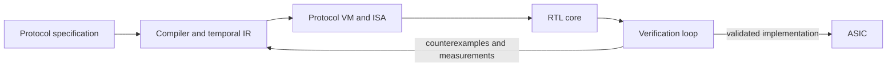

# Protocol Emulator ASIC

## Project Purpose

Build an open, compact, programmable protocol emulator that can express useful digital communication protocols while meeting hard temporal constraints and fitting within the competition's ASIC implementation envelope.

The project is both:

1. a concrete competition submission effort; and
2. a research program into the minimum computational substrate needed for deterministic protocol behavior.

## Competition Context

Jane Street's Protocol Emulator ASIC Competition asks entrants to design an open-source, general-purpose protocol emulator ASIC. The core targets are UART, SPI, and I2C, with USB low-speed and 10 Mbit Ethernet identified as stretch targets. The implementation path uses the Tiny Tapeout IHP flow and its CMOS5L Verilog template.

**Hard deadline:** 18 January 2027.

Primary brief: https://blog.janestreet.com/protocol-emulator-asic-competition/

## Research Question

> What is the smallest computational substrate that can efficiently express useful digital communication protocols under hard temporal constraints?

## Core Architecture Hypothesis

A small deterministic protocol virtual machine, driven by compiled temporal programs, can offer enough generality for multiple protocols while remaining smaller, more predictable, and easier to verify than a conventional processor-based design.

### Hypothesis Boundaries

- The instruction set must make temporal behavior explicit rather than incidental.
- Cycle-level determinism must be understandable from a program and machine configuration.
- Protocol programs should reuse one datapath and sequencer rather than instantiate protocol-specific controllers.
- Generality is valuable only while timing, area, verification complexity, and physical fit remain acceptable.

### Falsification Conditions

The hypothesis is weakened or rejected if any of the following persists after reasonable optimization:

- UART, SPI, and I2C cannot be represented cleanly without protocol-specific RTL escape hatches.
- Timing behavior cannot be statically bounded or verified.
- Interpreter overhead prevents required edge timing.
- Program/control storage dominates the area budget.
- A simpler fixed-function composition provides materially better coverage per area.
- The design cannot close timing or fit the target Tiny Tapeout/IHP envelope.

## Candidate ISA

| Primitive | Intent |
|---|---|
| `SET` | Drive one or more output signals to defined values. |
| `GET` | Sample input signals into machine state. |
| `WAIT` | Delay for an exact number of cycles or time quanta. |
| `WAIT_EDGE` | Suspend until a selected edge or qualified transition occurs. |
| `BRANCH` | Select control flow from sampled state or flags. |
| `LOOP` | Repeat a bounded instruction region with compact state. |
| `SHIFT_IN` | Sample and assemble a serial bit stream. |
| `SHIFT_OUT` | Serialize stored data with defined bit ordering. |
| `SYNC` | Align execution to an external event or timing boundary. |
| `HALT` | Enter a defined stopped or completed state. |

The ISA is provisional. Each primitive must earn its place through protocol coverage, implementation cost, timing semantics, and verification value.

## Target Protocols

### Core Targets

- UART
- SPI
- I2C

### Stretch Targets

- USB low-speed
- 10 Mbit Ethernet

Protocol implementations should begin as executable behavioral specifications and differential waveform oracles before they are treated as successful VM programs.

## Verification Strategy

### Formal Properties

- Safety properties for signal ownership, legal state transitions, bounded loops, and reset behavior.
- Temporal properties for exact waits, edge response, sampling windows, and absence of illegal glitches.
- Liveness or bounded-progress properties for non-faulted programs.
- Equivalence checks where a reference controller or reduced model is available.

### Constrained-Random Testing

- Randomize payloads, clock ratios, phase offsets, timing tolerances, stalls, resets, and adversarial inputs.
- Track functional and temporal coverage, not only transaction completion.
- Preserve seeds and minimized failures as durable evidence.

### Differential Waveform Testing

- Run the same protocol scenario through a trusted reference model and the protocol VM.
- Compare edges, sampled values, setup/hold windows, framing, and error behavior.
- Store mismatch traces as reproducible regression cases.

### FPGA Validation

- Validate real I/O behavior, clock-domain assumptions, metastability defenses, and interaction with physical devices.
- Use logic-analyzer captures as evidence linked to firmware, bitstream, board, and test conditions.

### AI-Assisted Verification

- Use AI to propose properties, adversarial sequences, coverage gaps, waveform explanations, and minimized counterexamples.
- Never treat AI output as proof; accept it only after independent tool or hardware validation.

## Milestones

| Milestone | Outcome | Exit Evidence |
|---|---|---|
| M0 — Toolchain | Working Tiny Tapeout/IHP RTL-to-GDS flow. | Reproducible minimal GPIO waveform design, tests, build logs, reports, and generated GDS. |
| M1 — Deterministic Sequencer | Minimal cycle-deterministic execution engine. | Formal timing properties and waveform tests for sequencing, waits, branches, and reset. |
| M2 — UART in Firmware | UART expressed as a program rather than protocol-specific RTL. | Differential UART waveforms, randomized frames, error cases, and resource measurements. |
| M3 — General ISA | One ISA supports UART, SPI, and I2C. | Three protocol programs, shared RTL core, coverage evidence, and no unjustified protocol-specific escape paths. |
| M4 — Compiler and Tooling | Protocol descriptions lower through a temporal IR into VM programs. | Reproducible compiler outputs, diagnostics, static timing checks, and protocol examples. |
| M5 — Verification and Physical Fit | Submission-ready implementation. | Formal and random regressions, FPGA evidence, synthesis/physical reports, fit margin, and reproducible release package. |

## Initial Backlog

### M0-T01 — Establish Tiny Tapeout/IHP RTL-to-GDS Toolchain

**This is the first task.**

Create a minimal design that emits a deterministic GPIO waveform, simulate it, test it, harden it through the Tiny Tapeout/IHP CMOS5L flow, and preserve enough evidence for another person to reproduce the result.

Acceptance criteria:

- The official CMOS5L template is used or its departure is explicitly justified.
- RTL produces a simple, specified GPIO pattern after reset.
- An automated test checks the waveform cycle by cycle.
- The complete RTL-to-GDS flow succeeds.
- Toolchain versions and environment assumptions are recorded.
- Build logs, timing and area reports, and generated artifact identifiers are preserved.
- A clean rerun reproduces the result.

Evidence links to create:

- RTL source and testbench
- expected waveform specification
- simulation waveform
- automated test result
- synthesis and physical-design logs
- timing and area reports
- GDS artifact and hash
- reproduction instructions

### Follow-on Backlog

1. Define clock, reset, GPIO, and timing-quantum assumptions.
2. Write M1 deterministic-sequencer semantics before broadening the ISA.
3. Implement `SET`, `WAIT`, and `HALT` as the smallest executable slice.
4. Add formal properties for reset, program-counter bounds, and exact wait duration.
5. Extend the slice with `GET`, `BRANCH`, and bounded `LOOP`.
6. Build a UART reference model and differential waveform harness.
7. Implement UART transmit and receive as VM firmware.
8. Measure instruction count, storage, cycles per bit, area, and timing margin.
9. Add `SHIFT_IN`, `SHIFT_OUT`, `WAIT_EDGE`, and `SYNC` only against demonstrated protocol needs.
10. Implement SPI and I2C programs and record where semantics strain the ISA.
11. Decide whether stretch protocols are feasible using measured rather than assumed headroom.

## Research Ledger Seed

| ID | Claim or Question | State | Falsification or Evidence Gate |
|---|---|---|---|
| H1 | A compact temporal VM can cover UART, SPI, and I2C. | Working hypothesis | All three run on one core without protocol-specific RTL and meet temporal tests. |
| H2 | Explicit temporal instructions reduce verification complexity. | Working hypothesis | Compare property/test complexity and failure modes with an equivalent conventional controller. |
| H3 | The candidate ISA is close to minimal. | Unproven | Remove or merge each primitive and measure lost expressiveness or increased cost. |
| H4 | Firmware interpretation can meet required timing. | Unproven | Synthesis and waveform results show adequate cycle and timing margin. |
| Q1 | What is the minimum useful timing quantum? | Open | Protocol requirements plus post-synthesis timing establish a bounded choice. |
| Q2 | How much program storage is affordable? | Open | Physical-fit reports and protocol program sizes establish the tradeoff. |
| Q3 | Which stretch protocol gives the strongest evidence of generality? | Open | Measured implementation feasibility and architectural reuse decide. |

## Persistent State

### Current Phase

M0 — toolchain establishment.

### Current Next Action

Execute M0-T01 and produce the first reproducible evidence bundle: a minimal deterministic GPIO waveform carried from RTL through GDS using the Tiny Tapeout/IHP flow.

### Decision Policy

- Promote a hypothesis only when multiple independent evidence types agree.
- Keep counterexamples and failed approaches; do not rewrite history.
- Link every milestone claim to artifacts that another person can inspect or rerun.
- Prefer measured timing, area, coverage, and waveform evidence over architectural confidence.

## Authoritative Sources

1. Jane Street, “Protocol Emulator ASIC Competition”  
   https://blog.janestreet.com/protocol-emulator-asic-competition/
2. Tiny Tapeout project and documentation  
   https://www.tinytapeout.com/
3. Tiny Tapeout IHP Verilog template, `cmos5l` branch  
   https://github.com/TinyTapeout/ttihp-verilog-template/tree/cmos5l

## Existing Khangelani OpenKnowledge Records

These remain the canonical local project records and can be uploaded individually if detailed source separation is preferred:

- `H:\hikrepos\khangelani\personal\projects\protocol-emulator-asic\project.md`
- `H:\hikrepos\khangelani\personal\projects\protocol-emulator-asic\backlog.md`
- `H:\hikrepos\khangelani\personal\projects\protocol-emulator-asic\milestones.md`
- `H:\hikrepos\khangelani\personal\projects\protocol-emulator-asic\research-ledger.md`
- `H:\hikrepos\khangelani\personal\projects\protocol-emulator-asic\state.md`
- `H:\hikrepos\khangelani\personal\projects\protocol-emulator-asic\verification.md`
- `H:\hikrepos\khangelani\personal\projects\protocol-emulator-asic\sources\origin-and-competition.md`
